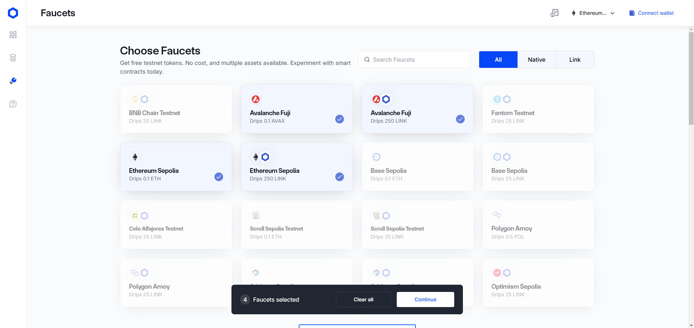

# Interchain Tokens Transfers using Chainlink CCIP

## Content

- [Getting gas](#getting-gas)
- [Our Interchain Transferor](#our-interchain-transferor)
- [Contract Addresses](#contract-addresses)
- [Another Important Values](#another-important-values)
- [Base ERC20](#base-erc20)
- [Transfer Tokens and Pay in Link](#transfer-tokens-and-pay-in-link)
- [Transfer Tokens and Pay in Native](#transfer-tokens-and-pay-in-native)
- [CCIP Explorer](#ccip-explorer)

## Getting gas
Lo primero que tendremos que hacer es obtener fondos para pagar el gas necesario para las pruebas que vamos hacer. En este casi estaremos usando Ethereum Sepolia y Avalanche Fuji para nuestras pruebas. Por lo tanto necesitaremos fondos en esas redes para pagar por el uso de la red y de los servicios de Chainlink.
Para pagar a Chainlink necesitaremos en token Link y para pagar el gas necesitaremos el token nativo de cada red. Usaremos el faucet de Chainlink para obtenerlos.

[Ir al faucet](https://faucets.chain.link/)



## Our Interchain Transferor

Ahora usaremos un Smart Contract en la red de origen para enviar tokens a otra red. Nuestra red de origen será **Ethereum Sepolia** y nuestro destino será **Avalanche Fuji**.

Usaremos el contrato de la [documentación de Chainlink para empezar](https://docs.chain.link/ccip/tutorials/cross-chain-tokens):

```ts
// SPDX-License-Identifier: MIT
pragma solidity 0.8.24;

import {IRouterClient} from "@chainlink/contracts-ccip/src/v0.8/ccip/interfaces/IRouterClient.sol";
import {OwnerIsCreator} from "@chainlink/contracts-ccip/src/v0.8/shared/access/OwnerIsCreator.sol";
import {Client} from "@chainlink/contracts-ccip/src/v0.8/ccip/libraries/Client.sol";
import {IERC20} from "@chainlink/contracts-ccip/src/v0.8/vendor/openzeppelin-solidity/v4.8.3/contracts/token/ERC20/IERC20.sol";
import {SafeERC20} from "@chainlink/contracts-ccip/src/v0.8/vendor/openzeppelin-solidity/v4.8.3/contracts/token/ERC20/utils/SafeERC20.sol";

/**
 * THIS IS AN EXAMPLE CONTRACT THAT USES HARDCODED VALUES FOR CLARITY.
 * THIS IS AN EXAMPLE CONTRACT THAT USES UN-AUDITED CODE.
 * DO NOT USE THIS CODE IN PRODUCTION.
 */

/// @title - A simple contract for transferring tokens across chains.
contract TokenTransferor is OwnerIsCreator {
    using SafeERC20 for IERC20;

    // Custom errors to provide more descriptive revert messages.
    error NotEnoughBalance(uint256 currentBalance, uint256 calculatedFees); // Used to make sure contract has enough balance to cover the fees.
    error NothingToWithdraw(); // Used when trying to withdraw Ether but there's nothing to withdraw.
    error FailedToWithdrawEth(address owner, address target, uint256 value); // Used when the withdrawal of Ether fails.
    error DestinationChainNotAllowlisted(uint64 destinationChainSelector); // Used when the destination chain has not been allowlisted by the contract owner.
    error InvalidReceiverAddress(); // Used when the receiver address is 0.
    // Event emitted when the tokens are transferred to an account on another chain.
    event TokensTransferred(
        bytes32 indexed messageId, // The unique ID of the message.
        uint64 indexed destinationChainSelector, // The chain selector of the destination chain.
        address receiver, // The address of the receiver on the destination chain.
        address token, // The token address that was transferred.
        uint256 tokenAmount, // The token amount that was transferred.
        address feeToken, // the token address used to pay CCIP fees.
        uint256 fees // The fees paid for sending the message.
    );

    // Mapping to keep track of allowlisted destination chains.
    mapping(uint64 => bool) public allowlistedChains;

    IRouterClient private s_router;

    IERC20 private s_linkToken;

    /// @notice Constructor initializes the contract with the router address.
    /// @param _router The address of the router contract.
    /// @param _link The address of the link contract.
    constructor(address _router, address _link) {
        s_router = IRouterClient(_router);
        s_linkToken = IERC20(_link);
    }

    /// @dev Modifier that checks if the chain with the given destinationChainSelector is allowlisted.
    /// @param _destinationChainSelector The selector of the destination chain.
    modifier onlyAllowlistedChain(uint64 _destinationChainSelector) {
        if (!allowlistedChains[_destinationChainSelector])
            revert DestinationChainNotAllowlisted(_destinationChainSelector);
        _;
    }

    /// @dev Modifier that checks the receiver address is not 0.
    /// @param _receiver The receiver address.
    modifier validateReceiver(address _receiver) {
        if (_receiver == address(0)) revert InvalidReceiverAddress();
        _;
    }

    /// @dev Updates the allowlist status of a destination chain for transactions.
    /// @notice This function can only be called by the owner.
    /// @param _destinationChainSelector The selector of the destination chain to be updated.
    /// @param allowed The allowlist status to be set for the destination chain.
    function allowlistDestinationChain(
        uint64 _destinationChainSelector,
        bool allowed
    ) external onlyOwner {
        allowlistedChains[_destinationChainSelector] = allowed;
    }

    /// @notice Transfer tokens to receiver on the destination chain.
    /// @notice pay in LINK.
    /// @notice the token must be in the list of supported tokens.
    /// @notice This function can only be called by the owner.
    /// @dev Assumes your contract has sufficient LINK tokens to pay for the fees.
    /// @param _destinationChainSelector The identifier (aka selector) for the destination blockchain.
    /// @param _receiver The address of the recipient on the destination blockchain.
    /// @param _token token address.
    /// @param _amount token amount.
    /// @return messageId The ID of the message that was sent.
    function transferTokensPayLINK(
        uint64 _destinationChainSelector,
        address _receiver,
        address _token,
        uint256 _amount
    )
        external
        onlyOwner
        onlyAllowlistedChain(_destinationChainSelector)
        validateReceiver(_receiver)
        returns (bytes32 messageId)
    {
        // Create an EVM2AnyMessage struct in memory with necessary information for sending a cross-chain message
        //  address(linkToken) means fees are paid in LINK
        Client.EVM2AnyMessage memory evm2AnyMessage = _buildCCIPMessage(
            _receiver,
            _token,
            _amount,
            address(s_linkToken)
        );

        // Get the fee required to send the message
        uint256 fees = s_router.getFee(
            _destinationChainSelector,
            evm2AnyMessage
        );

        if (fees > s_linkToken.balanceOf(address(this)))
            revert NotEnoughBalance(s_linkToken.balanceOf(address(this)), fees);

        // approve the Router to transfer LINK tokens on contract's behalf. It will spend the fees in LINK
        s_linkToken.approve(address(s_router), fees);

        // approve the Router to spend tokens on contract's behalf. It will spend the amount of the given token
        IERC20(_token).approve(address(s_router), _amount);

        // Send the message through the router and store the returned message ID
        messageId = s_router.ccipSend(
            _destinationChainSelector,
            evm2AnyMessage
        );

        // Emit an event with message details
        emit TokensTransferred(
            messageId,
            _destinationChainSelector,
            _receiver,
            _token,
            _amount,
            address(s_linkToken),
            fees
        );

        // Return the message ID
        return messageId;
    }

    /// @notice Transfer tokens to receiver on the destination chain.
    /// @notice Pay in native gas such as ETH on Ethereum or POL on Polgon.
    /// @notice the token must be in the list of supported tokens.
    /// @notice This function can only be called by the owner.
    /// @dev Assumes your contract has sufficient native gas like ETH on Ethereum or POL on Polygon.
    /// @param _destinationChainSelector The identifier (aka selector) for the destination blockchain.
    /// @param _receiver The address of the recipient on the destination blockchain.
    /// @param _token token address.
    /// @param _amount token amount.
    /// @return messageId The ID of the message that was sent.
    function transferTokensPayNative(
        uint64 _destinationChainSelector,
        address _receiver,
        address _token,
        uint256 _amount
    )
        external
        onlyOwner
        onlyAllowlistedChain(_destinationChainSelector)
        validateReceiver(_receiver)
        returns (bytes32 messageId)
    {
        // Create an EVM2AnyMessage struct in memory with necessary information for sending a cross-chain message
        // address(0) means fees are paid in native gas
        Client.EVM2AnyMessage memory evm2AnyMessage = _buildCCIPMessage(
            _receiver,
            _token,
            _amount,
            address(0)
        );

        // Get the fee required to send the message
        uint256 fees = s_router.getFee(
            _destinationChainSelector,
            evm2AnyMessage
        );

        if (fees > address(this).balance)
            revert NotEnoughBalance(address(this).balance, fees);

        // approve the Router to spend tokens on contract's behalf. It will spend the amount of the given token
        IERC20(_token).approve(address(s_router), _amount);

        // Send the message through the router and store the returned message ID
        messageId = s_router.ccipSend{value: fees}(
            _destinationChainSelector,
            evm2AnyMessage
        );

        // Emit an event with message details
        emit TokensTransferred(
            messageId,
            _destinationChainSelector,
            _receiver,
            _token,
            _amount,
            address(0),
            fees
        );

        // Return the message ID
        return messageId;
    }

    /// @notice Construct a CCIP message.
    /// @dev This function will create an EVM2AnyMessage struct with all the necessary information for tokens transfer.
    /// @param _receiver The address of the receiver.
    /// @param _token The token to be transferred.
    /// @param _amount The amount of the token to be transferred.
    /// @param _feeTokenAddress The address of the token used for fees. Set address(0) for native gas.
    /// @return Client.EVM2AnyMessage Returns an EVM2AnyMessage struct which contains information for sending a CCIP message.
    function _buildCCIPMessage(
        address _receiver,
        address _token,
        uint256 _amount,
        address _feeTokenAddress
    ) private pure returns (Client.EVM2AnyMessage memory) {
        // Set the token amounts
        Client.EVMTokenAmount[]
            memory tokenAmounts = new Client.EVMTokenAmount[](1);
        tokenAmounts[0] = Client.EVMTokenAmount({
            token: _token,
            amount: _amount
        });

        // Create an EVM2AnyMessage struct in memory with necessary information for sending a cross-chain message
        return
            Client.EVM2AnyMessage({
                receiver: abi.encode(_receiver), // ABI-encoded receiver address
                data: "", // No data
                tokenAmounts: tokenAmounts, // The amount and type of token being transferred
                extraArgs: Client._argsToBytes(
                    // Additional arguments, setting gas limit to 0 as we are not sending any data
                    Client.EVMExtraArgsV2({
                        gasLimit: 0, // Gas limit for the callback on the destination chain
                        allowOutOfOrderExecution: true // Allows the message to be executed out of order relative to other messages from the same sender
                    })
                ),
                // Set the feeToken to a feeTokenAddress, indicating specific asset will be used for fees
                feeToken: _feeTokenAddress
            });
    }

    /// @notice Fallback function to allow the contract to receive Ether.
    /// @dev This function has no function body, making it a default function for receiving Ether.
    /// It is automatically called when Ether is transferred to the contract without any data.
    receive() external payable {}

    /// @notice Allows the contract owner to withdraw the entire balance of Ether from the contract.
    /// @dev This function reverts if there are no funds to withdraw or if the transfer fails.
    /// It should only be callable by the owner of the contract.
    /// @param _beneficiary The address to which the Ether should be transferred.
    function withdraw(address _beneficiary) public onlyOwner {
        // Retrieve the balance of this contract
        uint256 amount = address(this).balance;

        // Revert if there is nothing to withdraw
        if (amount == 0) revert NothingToWithdraw();

        // Attempt to send the funds, capturing the success status and discarding any return data
        (bool sent, ) = _beneficiary.call{value: amount}("");

        // Revert if the send failed, with information about the attempted transfer
        if (!sent) revert FailedToWithdrawEth(msg.sender, _beneficiary, amount);
    }

    /// @notice Allows the owner of the contract to withdraw all tokens of a specific ERC20 token.
    /// @dev This function reverts with a 'NothingToWithdraw' error if there are no tokens to withdraw.
    /// @param _beneficiary The address to which the tokens will be sent.
    /// @param _token The contract address of the ERC20 token to be withdrawn.
    function withdrawToken(
        address _beneficiary,
        address _token
    ) public onlyOwner {
        // Retrieve the balance of this contract
        uint256 amount = IERC20(_token).balanceOf(address(this));

        // Revert if there is nothing to withdraw
        if (amount == 0) revert NothingToWithdraw();

        IERC20(_token).safeTransfer(_beneficiary, amount);
    }
}

```

## Contract Addresses

Para desplegar nuestro contrato necesitaremos la dirección del Router y del token Link en la red de origen. 

Para Sepolia las direcciones son las siguientes:

- **Router**: `0x0BF3dE8c5D3e8A2B34D2BEeB17ABfCeBaf363A59`
- **Link**: `0x779877A7B0D9E8603169DdbD7836e478b4624789`

Para Avalanche Fuji:

- **Router**: `0x0BF3dE8c5D3e8A2B34D2BEeB17ABfCeBaf363A59`
- **Link**: `0x0b9d5D9136855f6FEc3c0993feE6E9CE8a297846`

## Another Important Values

- **_destinationChainSelector**.
    - Avalanche Fuji.
        ```
        14767482510784806043
        ```
    - Ethereum Sepolia.
        ```
        16015286601757825753
        ```
- **_destination**: La dirección que recibirá en la red de destino. Puedes ser tu dirección.
- **_token**: La dirección del token que vamos a enviar. **Debe ser un token soportado por Chainlink**. Puedes ver los tokens soportados [aquí](https://docs.chain.link/ccip/supported-networks/v1_2_0/testnet#ethereum-sepolia-avalanche-fuji). En este caso usaremos USDC.
    - USDC on Ethereum Sepolia (6 decimales).
    ```
    0x1c7D4B196Cb0C7B01d743Fbc6116a902379C7238
    ```
    - USDC on Avalanche Fuji (6 decimales).
    ```
    0x5425890298aed601595a70AB815c96711a31Bc65
    ```

> **💡 Nota**: Para obtener USDC en redes de pruebas podemos usar el [faucet de Circle](https://faucet.circle.com/)

- **_amount**: Ya te imaginas.

## Base ERC20

Para dar `approve` de nuestro USDC vamos a necesitar un ERC20 muy simple para interactuar con el contrato desde Remix. Aqui te tienes uno.

```ts
// SPDX-License-Identifier: MIT
// Compatible with OpenZeppelin Contracts ^5.0.0
pragma solidity ^0.8.22;

import "@openzeppelin/contracts/token/ERC20/ERC20.sol";

contract BaseERC20 is ERC20 {
    constructor() ERC20("BaseERC20", "BERC20") {}
}
```

## Transfer Tokens and Pay in Link

Usa la función `transferTokensPayLINK` luego de haber añadido fondos en Link al contrato para hacer la transferencia entre cadenas.

## Transfer Tokens and Pay in Native

Usa la función `transferTokensPayNative` luego de haber añadido fondos en en token nativo de la red al contrato para hacer la transferencia entre cadenas.

## CCIP Explorer

Abre el [explorador](https://ccip.chain.link/) y busca la transacción utilizando el hash de la transacción en la red de origen.
